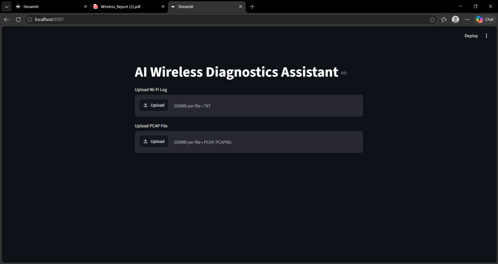
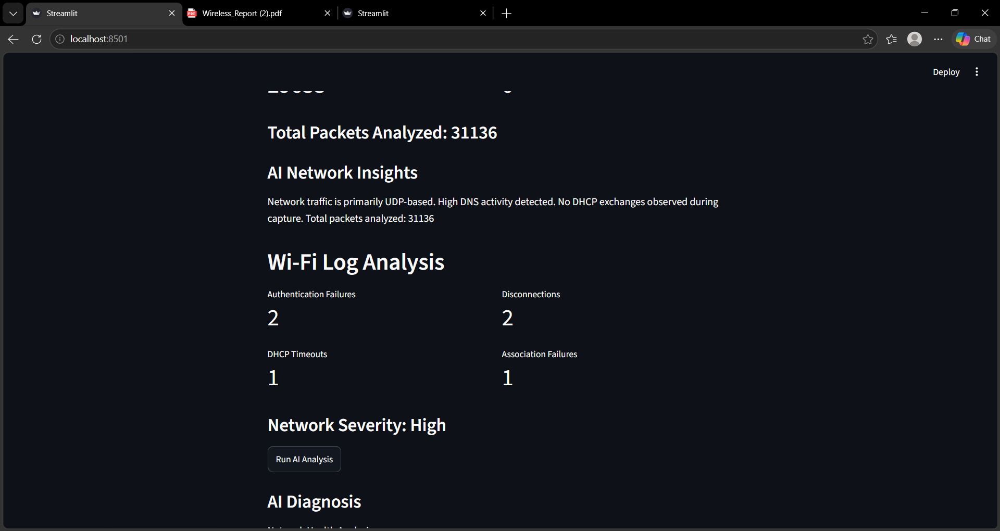
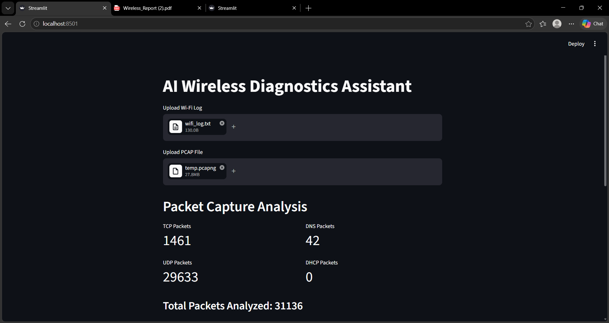
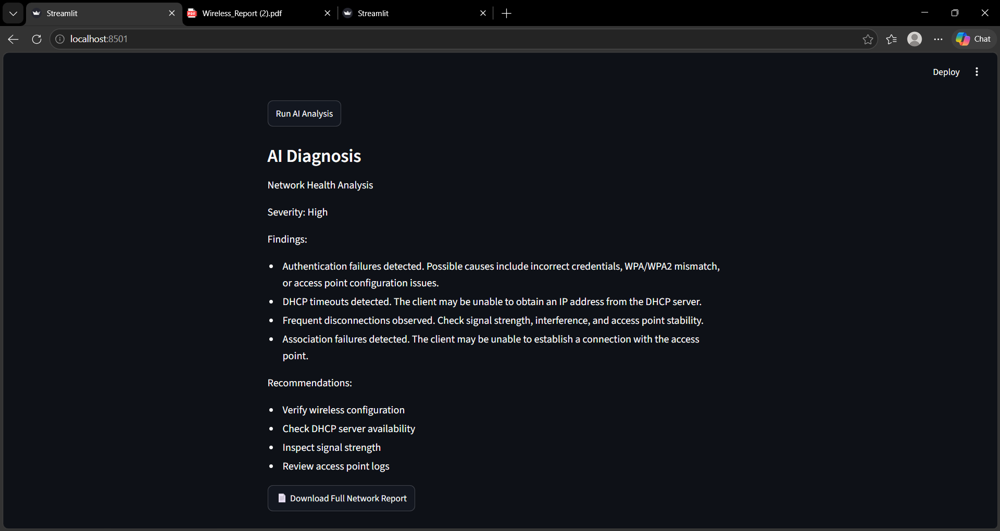
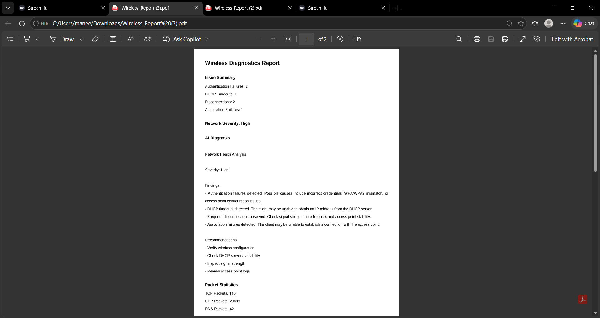

# AI Wireless Diagnostics Assistant

## Overview

AI Wireless Diagnostics Assistant is a Python-based wireless network troubleshooting platform that analyzes Wi-Fi logs and packet captures (PCAP files) to identify network issues, generate diagnostic insights, and create downloadable reports.

## Features

* Wi-Fi Log Analysis
* Authentication Failure Detection
* DHCP Timeout Detection
* Association Failure Detection
* Network Severity Scoring
* AI-Based Diagnostics
* Packet Capture (PCAP) Analysis
* AI Network Insights
* PDF Report Generation

## Tech Stack

* Python
* Streamlit
* PyShark
* Wireshark
* TShark
* FPDF
## Project Structure

## Installation

### Clone the Repository

```bash
git clone https://github.com/pallavi195/AI-Wireless-Diagnostics-Assistant.git
```

### Navigate to the Project Folder

```bash
cd AI-Wireless-Diagnostics-Assistant
```

### Install Dependencies

```bash
pip install -r requirements.txt
```

### Run the Application

```bash
streamlit run app.py
```

### Requirements

- Python 3.10+
- Wireshark
- TShark
- Streamlit
- PyShark


```text
AI-Wireless-Diagnostics-Assistant
│
├── app.py
├── analyzer.py
├── parser.py
├── pcap_parser.py
├── insights.py
├── report.py
├── requirements.txt
├── README.md
│
├── home.png
├── wi-fi-log-analysis.png
├── packet-analysis.png
├── ai-diagnosis.png
└── report.png
```

## Project Workflow

1. Upload Wi-Fi Log
2. Upload PCAP File
3. Analyze Network Issues
4. Generate AI Diagnostics
5. Generate AI Network Insights
6. Download Full Network Report

## Sample Output

* Authentication Failures
* DHCP Timeouts
* Disconnections
* Association Failures
* Packet Statistics
* Network Severity
* AI Recommendations

## Future Improvements

* DNS anomaly detection
* DHCP handshake validation
* Packet loss analysis
* Real-time packet monitoring
* LLM-powered troubleshooting recommendations

## Author

Pallavi Gollu

## Application Screenshots

### Home Screen


### Wi-Fi Log Analysis


### Packet Capture Analysis


### AI Diagnosis


### Generated PDF Report

